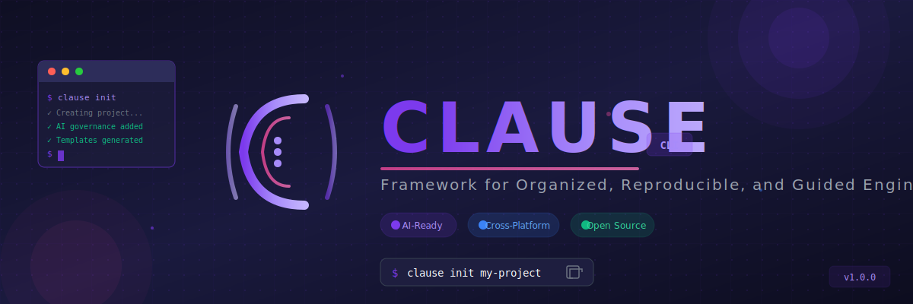

<p align="center">
  
</p>

<h1 align="center">Clause CLI</h1>

<p align="center">
  <strong>Structured Intelligence for AI-Driven Development</strong>
</p>

<p align="center">
  Clause CLI is an AI-native project scaffolding tool designed to guide AI coding assistants 
  toward generating consistent, maintainable, and architecturally sound codebases. 
  It establishes clear structural conventions, ensuring your AI outputs align with 
  best practices and long-term scalability requirements.
</p>

<p align="center">
  <a href="https://github.com/Mr-Dark-debug/clause-cli/releases">
    
  </a>
  <a href="https://github.com/Mr-Dark-debug/clause-cli/blob/main/LICENSE">
    
  </a>
  <a href="https://goreportcard.com/report/github.com/Mr-Dark-debug/clause-cli">
    
  </a>
</p>

---


---

## Why Clause?

Modern AI coding assistants are powerful, but their power is undirected. They can write virtually any code, but without proper guidance, that code may violate project standards, introduce inconsistencies, or create technical debt.

**Clause provides the direction that transforms raw AI capability into disciplined, project-aligned engineering output.**

### Key Differentiators

- **AI-Native Design** - Built from the ground up for AI-assisted development
- **Behavioral Governance** - Rules that guide AI behavior within your project
- **Brainstorm.md** - Novel self-reflection mechanism for autonomous AI problem-solving
- **Component Registry** - Living inventory of created components for reusability
- **Beautiful TUI** - Modern terminal interface with responsive design

---

## Features

### Interactive Project Wizard

Clause guides you through project configuration with a beautiful terminal UI:

```bash
$ clause init my-project
```

- Choose frontend framework (Next.js, React, Vue, Svelte)
- Choose backend framework (FastAPI, Express, Django, Go)
- Configure database, authentication, and infrastructure
- Set AI governance strictness level

### AI Governance System

Every Clause-generated project includes an `ai_prompt_guidelines/` directory that:

- Defines how AI should behave in your project
- Specifies approved technologies and forbidden patterns
- Provides architectural constraints
- Includes documentation standards
- Offers a Brainstorm.md file for AI self-reflection

### Cross-Platform Support

Works on macOS, Linux, and Windows with native binaries.

---

## Installation

### Quick Install (Recommended)

The easiest way to install Clause CLI globally:

```bash
# Install Go if you haven't: https://go.dev/doc/install
# Then run:
go install github.com/Mr-Dark-debug/clause-cli/cmd/clause@latest
```

This installs `clause` to `$GOPATH/bin` (or `$HOME/go/bin`), making it available globally.

**Important:** Make sure your Go bin directory is in your PATH:

```bash
# Add to your shell profile (~/.bashrc, ~/.zshrc, etc.)
export PATH="$PATH:$(go env GOPATH)/bin"
```

### From Source

```bash
# Clone the repository
git clone https://github.com/Mr-Dark-debug/clause-cli.git
cd clause-cli

# Install dependencies and build
go mod download

# Install globally
go install ./cmd/clause

# Or build to local bin directory
make build
```

### Platform-Specific (Coming Soon)

**macOS (Homebrew)**
```bash
brew install clause-cli/tap/clause
```

**Windows (Winget)**
```powershell
winget install Clause.ClauseCLI
```

**Windows (Scoop)**
```powershell
scoop bucket add clause-cli https://github.com/Mr-Dark-debug/scoop-bucket
scoop install clause
```

### Verify Installation

```bash
clause version
```

Output:
```
Clause - AI-Native Project Scaffolding

  Version:    1.0.0
  Go Version: go1.21.x
  Platform:   darwin/arm64

+---------------------------------------------+
|                                             |
|  Run 'clause init' to create a new project  |
|                                             |
+---------------------------------------------+
```

---

## Quick Start

### Create a New Project

```bash
# Interactive mode (launches TUI wizard)
clause init my-awesome-project

# With a preset (non-interactive)
clause init my-saas --preset saas --non-interactive

# Specify a custom path
clause init my-project --path ./projects
```

### Available Presets

| Preset | Description |
|--------|-------------|
| `minimal` | Minimal configuration with only essentials |
| `standard` | Standard full-stack configuration (default) |
| `saas` | Full-featured SaaS with auth, payments, i18n |
| `api-only` | Backend-only API project |
| `frontend-only` | Frontend-only project |
| `enterprise` | Enterprise-grade with observability, security |

### What Clause Creates

```
my-awesome-project/
├── src/                         # Frontend application
│   ├── src/
│   │   ├── App.tsx
│   │   └── index.tsx
│   ├── package.json
│   └── tsconfig.json
│
├── backend/                     # Backend application
│   ├── app/
│   │   └── __init__.py
│   ├── main.py
│   ├── requirements.txt
│   └── pyproject.toml
│
├── ai_prompt_guidelines/        # AI reads this!
│   ├── system_prompt.md         # Core AI behavior rules
│   ├── architecture.md          # Architectural constraints
│   ├── brainstorm.md            # AI working memory
│   └── component_registry.json  # Component registry
│
├── .clause/                     # Clause configuration
│   ├── config.yaml              # Project configuration
│   ├── context.yaml             # Structured context
│   ├── registry.yaml            # Component registry
│   └── prompt-guidelines.md     # AI prompt guidelines
│
├── Dockerfile                   # Docker configuration
├── docker-compose.yml           # Docker Compose setup
├── .github/workflows/main.yml   # CI/CD pipeline
├── .gitignore
├── .editorconfig
├── README.md
└── Brainstorm.md                # AI self-reflection file
```

### Work with AI Assistants

When you open your Clause-generated project in an AI coding assistant (Claude Code, Cursor, Windsurf, GitHub Copilot, etc.), the AI will automatically find the `ai_prompt_guidelines/` directory and follow the rules defined there.

---

## CLI Reference

### Global Commands

```bash
clause --help          # Show help
clause --version       # Show version (short: -v)
clause --config FILE   # Use custom config file
clause --no-color      # Disable colored output
clause --quiet         # Suppress non-essential output (short: -q)
clause --verbose       # Enable verbose output (short: -v)
```

### init - Create a New Project

```bash
clause init [project-name] [flags]

Flags:
  -n, --non-interactive   Run without prompts (use defaults)
  -p, --preset string     Use a preset (minimal, standard, saas, api-only, frontend-only, enterprise)
      --path string       Project creation path (default: current directory)
      --dry-run           Show what would be created without creating files

Examples:
  clause init                        # Launch interactive wizard
  clause init my-project             # Create with interactive wizard
  clause init my-saas -p saas -n     # Create SaaS project non-interactively
  clause init my-api --preset api-only --non-interactive
```

### add - Add Components to Project

```bash
clause add <type> [subtype] <name> [flags]

Types:
  frontend    Add frontend components
  backend     Add backend components
  governance  Add governance rules

Frontend Subtypes: component, page, hook, utility, context
Backend Subtypes: service, route, model, schema, utility, middleware

Flags:
  -d, --description string   Component description
  -p, --path string          Custom component path
      --deps strings         Component dependencies
      --tags strings         Component tags

Examples:
  clause add frontend component Button
  clause add frontend page Dashboard
  clause add frontend hook useAuth
  clause add backend route users
  clause add backend model User
  clause add backend service PaymentService
```

### validate - Validate Project Compliance

```bash
clause validate

Validates:
  - AI context files
  - Component registry
  - Governance rules
  - Documentation standards
  - Code patterns

Example output:
  AI context files          PASS
  Component registry        PASS
  Governance rules          WARN
  Documentation standards   PASS
  Code patterns             PASS

  Summary: 4/5 checks passed, 1 warnings
```

### config - Manage Configuration

```bash
clause config list              # View current configuration
clause config set <key> <value> # Set a configuration value
clause config reset             # Reset to defaults

Examples:
  clause config list
  clause config set defaults.frontend nextjs
  clause config set defaults.backend fastapi
```

### version - Show Version

```bash
clause version
```

### update - Update Clause CLI

```bash
clause update              # Update to latest stable
clause update --preview    # Preview available updates
```

---

## Configuration

Clause CLI can be configured via a YAML file at `~/.clause/config.yaml`:

```yaml
defaults:
  frontend: nextjs       # Default frontend framework
  backend: fastapi       # Default backend framework
  database: postgresql   # Default database
  license: MIT           # Default license

telemetry:
  enabled: true          # Enable anonymous usage stats

updates:
  channel: stable        # Update channel (stable/beta)
  check_frequency: 24h   # How often to check for updates
```

### Environment Variables

| Variable | Description |
|----------|-------------|
| `CLAUSE_CONFIG` | Path to custom config file |
| `CLAUSE_NO_COLOR` | Disable color output |
| `CLAUSE_DEBUG` | Enable debug logging |

---

## Contributing

We welcome contributions! Please see [CONTRIBUTING.md](CONTRIBUTING.md) for details.

### Development Setup

```bash
# Clone the repository
git clone https://github.com/Mr-Dark-debug/clause-cli.git
cd clause-cli

# Install dependencies
go mod download

# Build
make build

# Run tests
make test

# Install globally for testing
make install-go

# Run locally
./bin/clause init test-project
# Or after install-go:
clause init test-project
```

### Available Make Targets

```bash
make build          # Build for current platform
make build-all      # Build for all platforms
make test           # Run tests
make test-coverage  # Run tests with coverage report
make lint           # Run linter
make fmt            # Format code
make install-go     # Install using go install
make clean          # Remove build artifacts
make run            # Build and run
make help           # Show all available targets
```

### Project Structure

```
clause-cli/
├── cmd/clause/             # Entry point
├── internal/               # Private packages
│   ├── cmd/                # CLI commands
│   ├── wizard/             # Interactive wizard
│   ├── config/             # Configuration management
│   ├── template/           # Template engine
│   ├── generator/          # Project generation
│   └── governance/         # AI governance system
├── pkg/                    # Public packages
│   ├── styles/             # Theme and styling
│   ├── tui/                # Terminal UI components
│   └── utils/              # Utilities
└── templates/              # Project templates
```

---

## License

Clause CLI is released under the [MIT License](LICENSE).

---

## Acknowledgments

Built with:
- [Cobra](https://github.com/spf13/cobra) - CLI framework
- [Bubble Tea](https://github.com/charmbracelet/bubbletea) - Terminal UI
- [Lip Gloss](https://github.com/charmbracelet/lipgloss) - Terminal styling

---

## Connect

- **GitHub**: [github.com/Mr-Dark-debug/clause-cli](https://github.com/Mr-Dark-debug/clause-cli)
- **Discord**: [Join our community](https://discord.gg/clause)
- **Twitter**: [@ClauseCLI](https://twitter.com/ClauseCLI)

---

<p align="center">
  Made with love for the developer community
</p>
